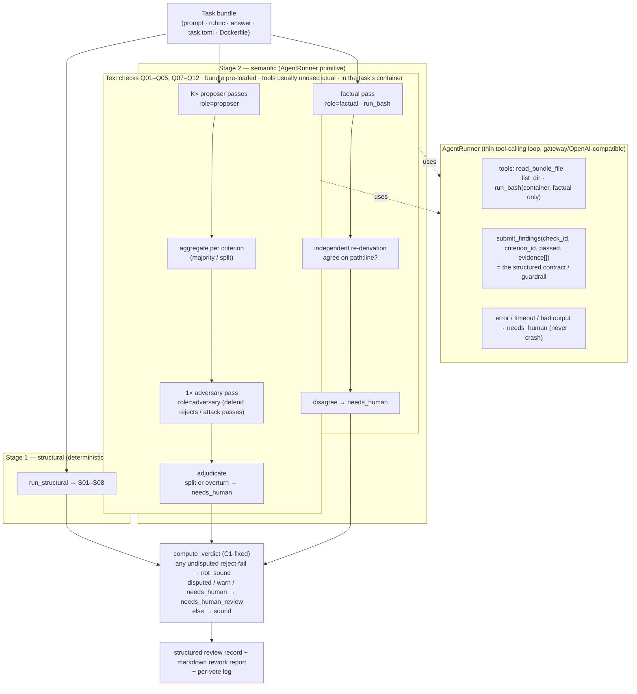

# AutoQC Semantic Layer — Agent Architecture (revision)

Date: 2026-08-25
Status: Draft for review
Supersedes: the single-shot semantic engine from the Milestone-2 plan (scrapped)
Companion: `2026-08-25-autoqc-execution-harness-design.md`, `2026-08-25-autoqc-quality-rubric-design.md`

## 1. Why this revision

The first Milestone-2 build modeled each semantic check as a per-criterion,
single-shot LLM call with a hand-written prompt + parser. Two problems:

1. It could not do **Q06** (factual correctness at `base_commit`), which must
   clone/build the repo, read source, and run programs in the task's container —
   a tool-using agent, not a single call.
2. It was the wrong granularity for the **cross-criterion** checks (Q04 coverage,
   Q12 redundancy), which need to see the whole rubric at once, and it multiplied
   cost (K proposers × 1 adversary **per criterion**).

The pivot: **one tool-using agent primitive** for all twelve semantic checks
(Q01–Q12), role-parameterized by instruction. It is a *judge that emits
structured verdicts*, not a code-solver — with tools available only for the
checks that need the repository. For the eleven text checks the bundle is
pre-loaded into context, so the agent usually answers in one turn with **zero**
tool calls (cheap); for Q06 the same agent reaches for a shell inside the
container.

Not forking `mini-swe-agent`: it is an excellent minimal *bash-solver* for
SWE-bench-style tasks and a good reference for Q06's container loop, but it emits
a task solution, not a structured multi-check verdict, and wrapping the text
checks in a bash loop is pure overhead. We build a thin loop that emits our
contract and reuse its bash-in-container idea for the Q06 role.

## 2. What survives, what is rebuilt

- **Survives:** `autoqc/llm.py` (the model client the agent sits on; `FakeLLMClient`
  for tests), `autoqc/seed.py` (defect generator — architecture-independent),
  `autoqc/verdict.py` (with the C1 fix: a *disputed* reject → `needs_human_review`),
  all of Milestone 1 (structural + reports + CLI), and the **adjudication logic**
  (majority / split / overturn → `needs_human`) as a concept.
- **Rebuilt:** the per-criterion `SemanticCheck` contract, engine, and Q07 check
  (deleted). Replaced by the `AgentRunner` primitive + role passes + a structured
  finding contract.

## 3. The `AgentRunner` primitive

A thin tool-calling loop over the gateway's OpenAI-compatible API (already used by
`GatewayLLMClient`; routes through the token gateway; `FakeLLMClient` still drives
all tests deterministically).

```
run_agent(role, context, tools, model_client, max_turns) -> AgentResult
  messages = [system(role.instructions), user(context)]
  for _ in range(max_turns):
      resp = model_client.chat(messages, tools=tools.schemas())
      if resp.tool_calls:
          for call in resp.tool_calls:
              result = tools.execute(call)         # read_file / list_dir / run_bash
              messages.append(tool_result(result))
          continue
      if resp.submit_findings:                     # the terminal tool
          return AgentResult(findings=resp.findings, transcript=messages)
  return AgentResult.timeout()                      # -> caller degrades to needs_human
```

- **Role** = a system prompt + which checks to evaluate + whether `run_bash` is
  enabled. Three roles: `proposer`, `adversary` (asymmetric: defend rejects /
  attack passes), `factual` (Q06, tools enabled).
- **Tools:**
  - `read_bundle_file(path)` — prompt.txt / rubrics.json / answer.txt / task.toml.
  - `list_dir(path)`.
  - `run_bash(cmd)` — **only enabled for the `factual` role**, scoped to the task's
    built container (the faithful `environment/Dockerfile`).
  - `submit_findings(findings)` — the terminal tool; its schema **is** the
    structured contract below.
- **Robustness (I1):** every `run_agent` call is isolated. A model error, a
  timeout, a malformed submission, or a tool failure degrades that pass to a
  `needs_human` sentinel — never a crash, never a silent pass. Structural results
  already computed are never discarded.

## 4. The structured contract (the guardrail)

The agent is a **strict executor of the calibrated 12 checks, not a free-form
critic.** `submit_findings` accepts only:

```
findings: [ { check_id: "Q01".."Q12",
              criterion_id: <rubric id | "rubric">,
              passed: <bool>,
              evidence: [ <quoted prompt/rubric span | "path:line" for Q06> ],
              reason: <str> } ]
```

The agent may not invent checks or criteria; `check_id` must be one of the twelve,
`criterion_id` must exist in the rubric (or the sentinel `"rubric"` for
per-rubric checks). This is what keeps the output auditable and prevents the
"this rubric seems weak" failure mode. A finding without evidence is rejected by
the caller and treated as `needs_human` for that item.

## 5. Ensemble, adversary, adjudication — as passes

Per the execution-harness spec §3/§5, unchanged in intent, now expressed as agent
passes rather than per-criterion votes:

1. **K proposer passes** (`role=proposer`) over the whole rubric → K structured
   finding sets. Aggregate per (check_id, criterion_id): majority `passed`;
   non-unanimous = split.
2. **1 adversary pass** (`role=adversary`), asymmetric by the aggregated verdict:
   defend the flagged rejects, attack the passes. Overturn = adversary disagrees
   with the aggregate.
3. **Adjudicate** per finding: `split or overturn → needs_human`; else the
   aggregate stands. Roll findings up to one `CheckResult` per check
   (`passed = all`, `needs_human = any`), feeding the C1-fixed verdict.
4. **Q06** is a distinct pass: `role=factual` inside the container, tools enabled,
   independent re-derivation (a second factual pass must agree on the cited
   `path:line`); 2 rounds; disagreement → `needs_human`.

**Per-vote logging:** every proposer/adversary/factual pass and its findings are
persisted to the review record (auditability + the T03 repeatability the
calibration harness needs). This is the fix for the "logging lost" note.

## 6. Cost shape

- Text checks: K proposer passes + 1 adversary pass over the **whole rubric**,
  each usually 1 turn, 0 tool calls → ~K+1 model calls total for all eleven text
  checks per task (vs ~200 single-shot calls in the scrapped design).
- Q06: the expensive one — a container build once per task + a multi-turn
  tool-using agent (+ its re-derivation). This is the dominant cost and is
  expensive in any design; it is why Q06 is its own role/pass.

## 7. Architecture diagram



## 8. Build order (next plan)

1. **`AgentRunner` + tools + structured contract** — the loop, `read_bundle_file`,
   `list_dir`, `submit_findings`; `FakeLLMClient`-driven tests for the loop
   (tool call → result → submit; timeout → sentinel; malformed submission →
   needs_human).
2. **Proposer + adversary text passes** for a first batch of text checks (Q07
   negative-semantics + Q03 wildcard as the two most-testable), with the
   ensemble/adjudication wiring and per-vote logging.
3. **Remaining text checks** (Q01, Q02, Q04, Q05, Q08–Q12).
4. **Q06 factual role** — `run_bash` in the built container, re-derivation, the
   mini-swe-agent-style bash loop.
5. **Live smoke + calibration** — first real-gateway run over the internal 10 +
   seeded corpus; K / max_turns / thresholds tuned against §8 of the harness spec.

## 9. Open questions

- Exact `submit_findings` schema fields (confidence? per-finding severity, or
  inherit from the check id?).
- Container lifecycle: build once per task and reuse across the Q06 re-derivation
  passes (yes) — how to cache builds across a calibration run of 134 tasks.
- Whether one proposer pass should cover all eleven text checks at once, or be
  split into 2–3 grouped passes to avoid shallow per-check judgments (decide by
  measuring judgment depth in the smoke run).
